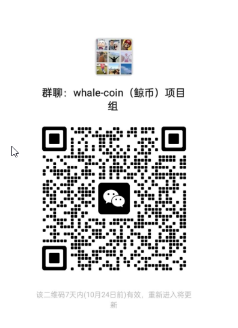

# whale-coin

## 技术栈
- 后端
  - fastapi
- 前端
  - vue3
  - typescript
- 数据库
  - mysql

## 基础层功能：
用户注册登录
修改密码
忘记密码后重置
## 业务层功能
### 申报鲸币
打开这个页面后，系统会自动展示你参与的所有datawhale项目和你在其中的角色。角色分为负责人、贡献者和保姆。每个项目后都会显示你当前是否存在可申报。

### 审批鲸币
打开这个页面后，系统会自动展示所有申报后等待审批的鲸币项目。只开放给管理员

### 消费鲸币
这个页面展示了所有已消费的鲸币事项，只开放给管理员。

### 收支明细
这个页面展示了一个人所有鲸币的收支明细

## 人员安排
- 基础层功能搭建 （[黎伟](https://github.com/omige)）
- 前端业务页面开发 （黎伟）
- 后端业务接口开发 （组长：王凯立。协助：李圣辉 ）
- router/index.ts 编写、前端编译 （高增玉）
- github 数据接口开发 （组长：封小洋。协助：珞索）
- 页面美化 （组长：[邢硕](https://github.com/Susan2048)。协助：吴傲 ）

### 项目交流群

🎉 whale-coin 项目微信交流群，如果你也对本项目感兴趣，欢迎加入群聊参与讨论交流或者加入一起开发。
